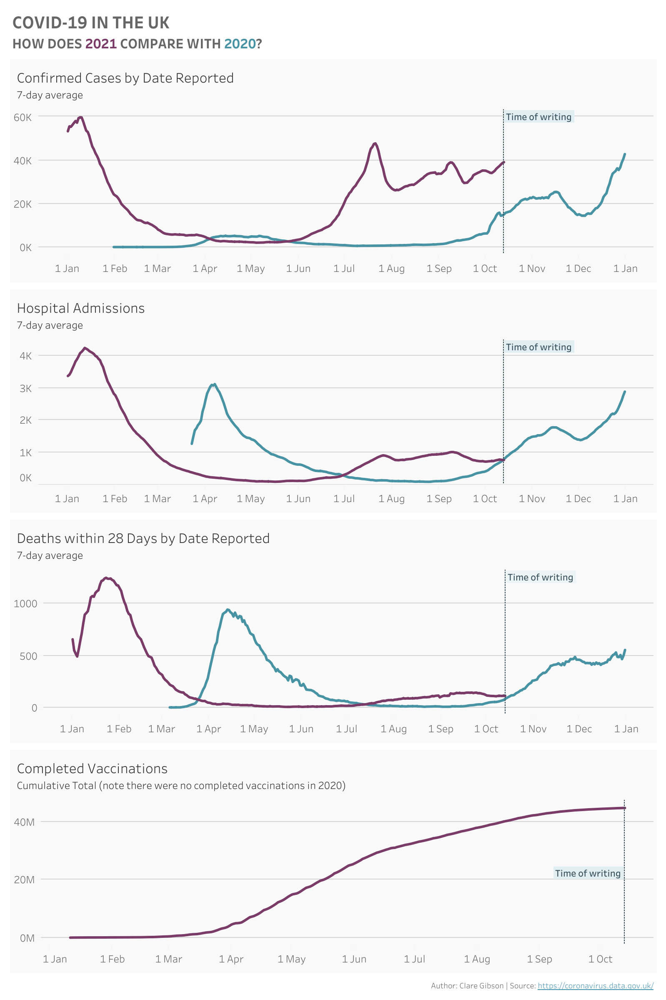

# COVID-19 UK Data

The screenshot below shows the dashboard I created for this analysis as it appeared on 14th October 2021. To view the latest data, see the [original visualization](https://public.tableau.com/app/profile/clare.gibson/viz/UKCovid2020-2021/UKCOVID2020-2021). For additional commentary and analysis, please visit my corresponding [blog post](https://surreydatagirl.blogspot.com/2021/10/covid-19-in-uk.html).

